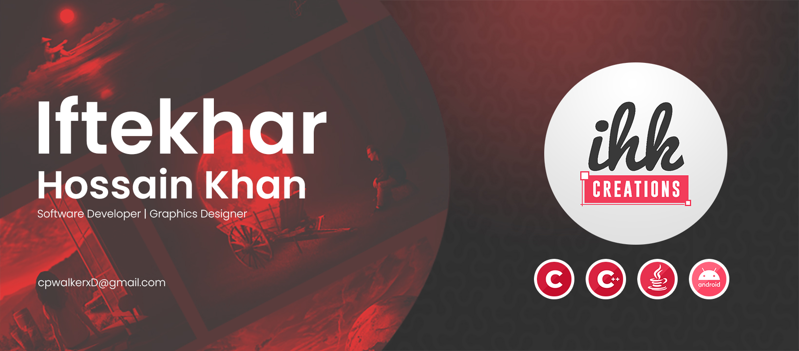

## Hi there, I am Iftekhar Hossain Khan...🖐
 

I'm Iftekhar. I'm an Software Developer, a Programmer and a Graphic Designer. Right now, I am developing my programming skills but mostly I do designing. Looking ahead to work in a IT/Software company as a Software Engineer after completing my graduation.

- 🌱 I’m currently learning Python, Javascript.
- 👯 I’m looking to collaborate on Open Source Projects, PC Games, Designing.
- 🤔 I’m now practicing on developing desktop apps, android apps and database integrated apps.

 

## Find me here:

[][discord]
[][linkedin]
[][behance]
[][stackoverflow]

## Programming Languages:

## Tools/Softwares:
 

## Git Stats:

[behance]: https://www.behance.net/ihkcreations
[discord]: https://discord.com/users/647492745228845118
[linkedin]: https://www.linkedin.com/in/ihkcreations/
[stackoverflow]: https://stackoverflow.com/users/22533372/cpwalker

